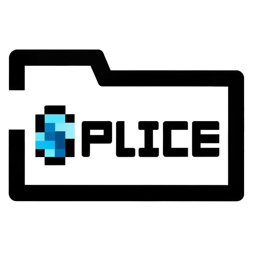

<br/>
<div align="center">
  <h1>Splice</h1>
  <a href="https://github.com/TerraFirmaGreg-Team/Splice">
    
  </a>
</div>

<br/>

---

Client-side mod that merges split lang folders at reload. 
Flat `lang/{locale}.json` / `.lang` plus `lang/{locale}/**` fragments are served as one synthetic file from a virtual pack at **TOP**

## Build

```bash
./gradlew :core:test
./gradlew :modern:remapShadowJar   # build/libs/Splice-Modern-*.jar
./gradlew :vintage:remapShadowJar  # build/libs/Splice-Vintage-*.jar
```

## Authoring

**1.20 / KubeJS** - from Modpack-Modern `kubejs/assets/tfg/lang/`:

```text
kubejs/assets/tfg/lang/
  en_us/              # fragments (merged in path order)
    items.json
    blocks.json
    quests/...
  de_de.json          # flat file still works
```

```json
{
  "item.tfg.antipoison_pill": "Antipoison Pill",
  "item.tfg.haste_pill": "Haste Pill"
}
```

**1.12 / GroovyScript** - same tree under `groovy/assets/{ns}/lang/`, extension `.lang`:

```text
groovy/assets/tfg/lang/
  en_us/
    items.lang
  en_us.lang
```

Keys starting with `__` are skipped. Later packs / later fragment paths win.
